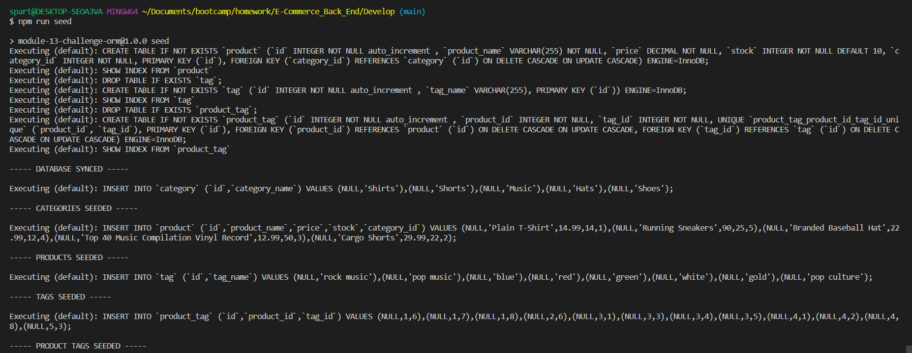
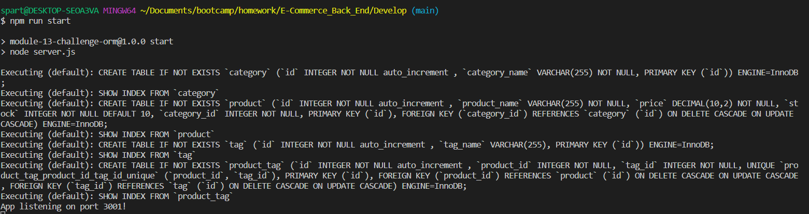

# E-Commerce_Back_End

## Description
E-Commerce application that manages a company data.That can create, delete, or view data. 

## Table of Contents
- [Installation](#installation)
- [Credits](#credits)
- [Usage](#usage)
- [Walk Through](#walk-through)
- [Deployment](#deployment)
- [License](#license)
- [Contact me](#contact-me)
## Installation

 You need to install Node.js ,"npm install express"
  "npm install dotenv"
 "npm install sequelize"
 "npm install mysql2".

## Credits 

Vidal Tan

## Usage

## Walk Through

https://drive.google.com/file/d/1jm01NT-GOyliNwp46ukwFqak0j3vUen_/view

https://drive.google.com/file/d/1iDoi-kpe_YgDze5FqBCMqMyH4t0F2JrK/view

## Deployment

[GitHub Pages](https://github.com/GustavoTijerino1/employee-tracker)

## License

 MIT License

## Contact me
How to reach me if you have any additional questions.

[GitHub](https://github.com/GustavoTijerino1)

Email: busg26@gmail.com

